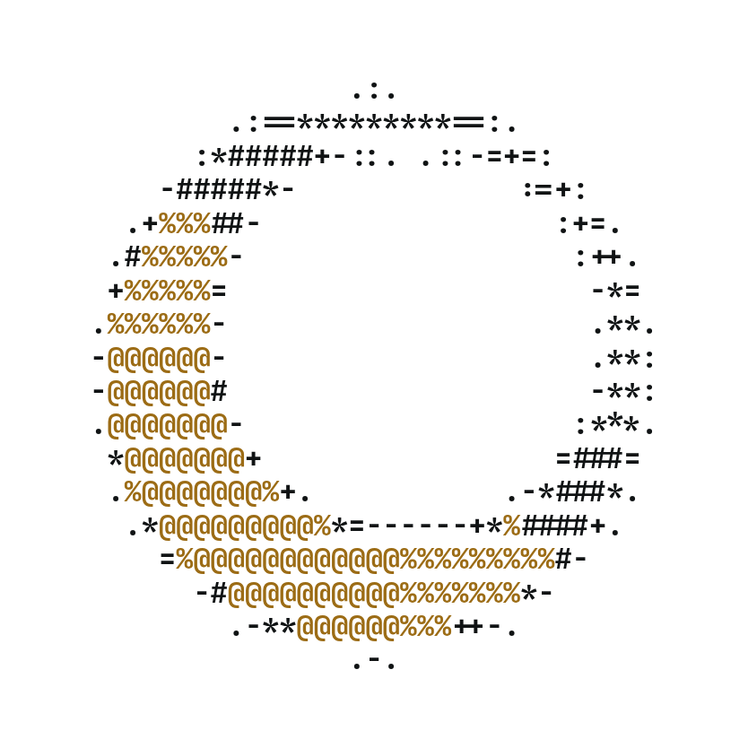

<p align="center">
  <picture>
    <source media="(prefers-color-scheme: dark)" srcset="brand/logo-dark.png">
    
  </picture>
</p>

<h3 align="center">Kolo</h3>

<p align="center">
  Shared coding agents for your team.<br>
  One machine runs them. Everyone else opens a link.
</p>

<p align="center">
  <a href="https://github.com/whosgotch/kolo/actions/workflows/ci.yml"></a>
  <a href="https://github.com/whosgotch/kolo/releases/latest"></a>
  <a href="LICENSE"></a>
</p>

<br>

## Install

On the machine you are lending, the only one that installs anything:

```
curl -fsSL https://raw.githubusercontent.com/whosgotch/kolo/main/install | sh
```

## Run

```
$ kolo up

api is up at http://192.168.0.12:7300
Lending anywhere · claude opencode · 3 members

Invite  http://192.168.0.12:7300/join#kolo_yPNNK8ZnHdvgKFDiQV2Oc…
        10 uses left, until Mon 31 Aug 20:34
```

Send the link. Whoever opens it picks a name and is in. Nothing to install,
no token to paste.

**One screen, everybody on it.** Watch an agent work, type at it, take over
mid-sentence. Whoever typed last drives, and everyone sees who.

**Nothing to open.** The host dials out over one websocket. No inbound port,
no firewall rule, no tunnel.

**Anything that draws a terminal.** Claude Code and opencode out of the box,
and one small file describes another.

## Early

Kolo is pre-1.0, so expect rough edges. It reads what an agent is doing off
that agent's own screen, so a CLI that changes its wording quietly breaks the
status line. `kolo doctor` says when that has happened.

The hub runs code on the host by design. Read [SECURITY.md](SECURITY.md)
before pointing kolo at anything you care about.

## Docs

`kolo help` is the manual. Beyond it:
[reference](docs/reference.md) · [security](SECURITY.md) · [contributing](CONTRIBUTING.md)

## License

[AGPL-3.0](LICENSE)
